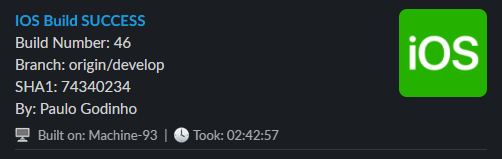
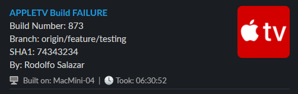

# build-report-slack-message
Builds a [Slack Block Kit](https://api.slack.com/block-kit) message payload using information from a Jenkins job, or any other information source. The message is contructed based on templates found in [BlockKitTemplates](BlockKitTemplates/) folder.

**Clone the repository and try it out with:**
```
$data = Get-Content './SampleData_success.json' -Raw
$message = ./CreateBuildReportMessage -JobName 'ios' -JsonData $data
Write-Output 'Sent:' $message
```

## Samples
iOS Build Success <br>
 <br>
Apple TV Build Failure <br>


## Jenkins usage

// TODO